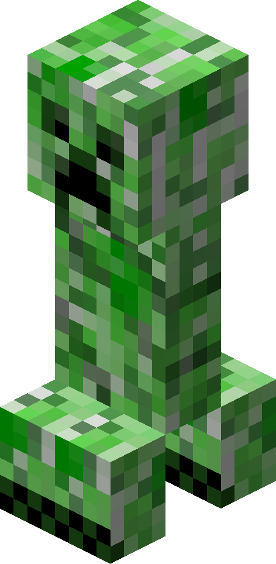
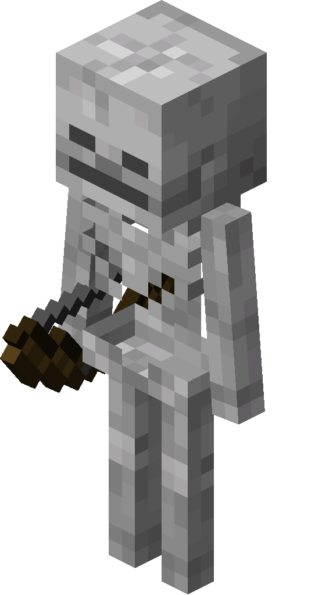
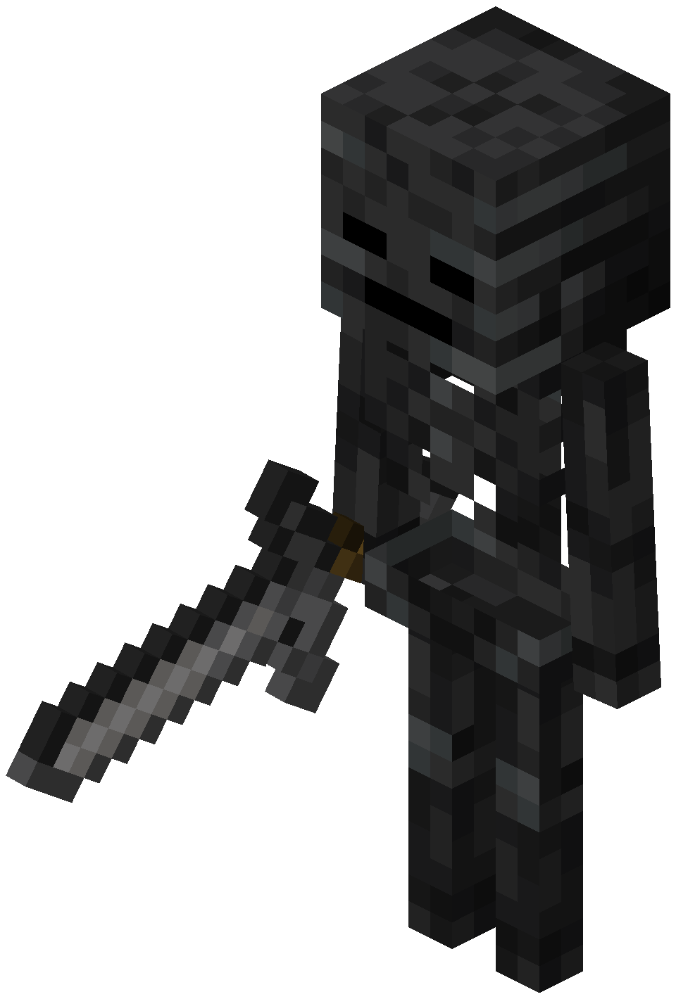
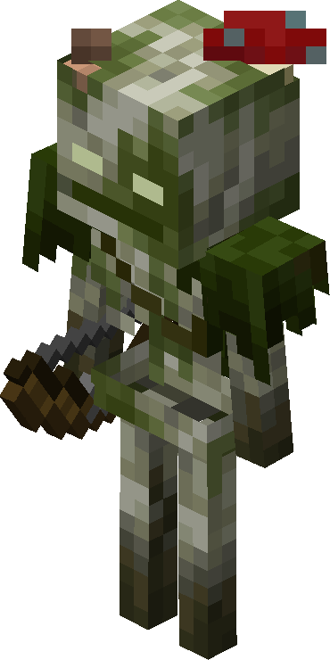
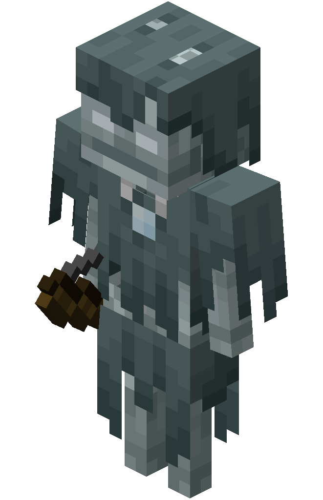
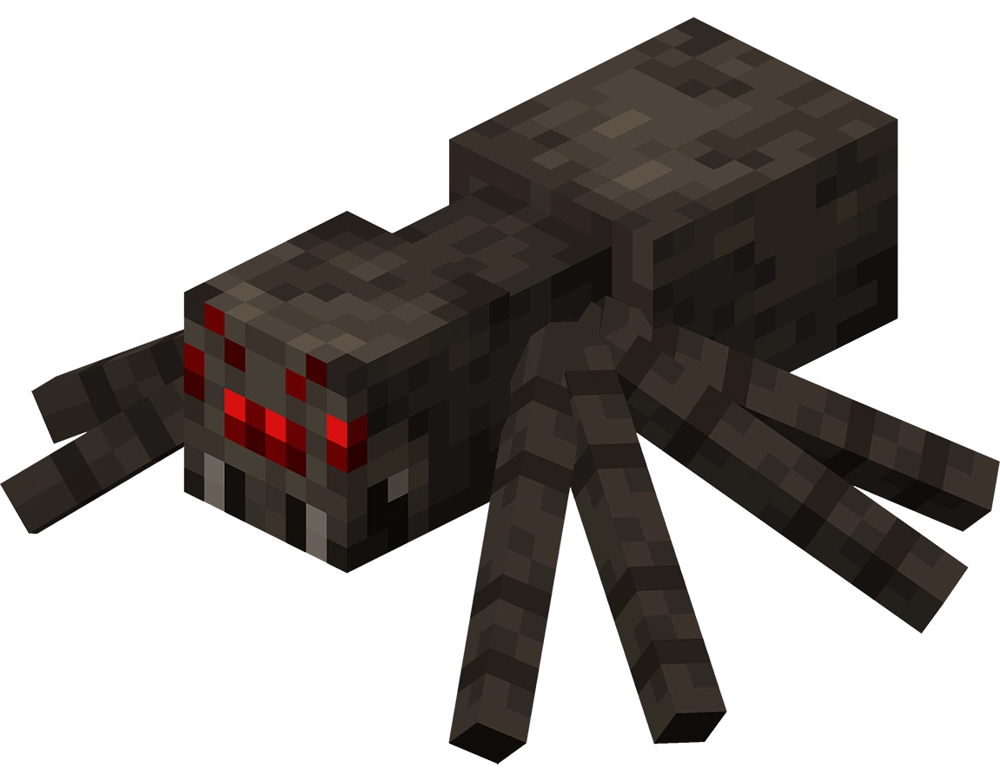
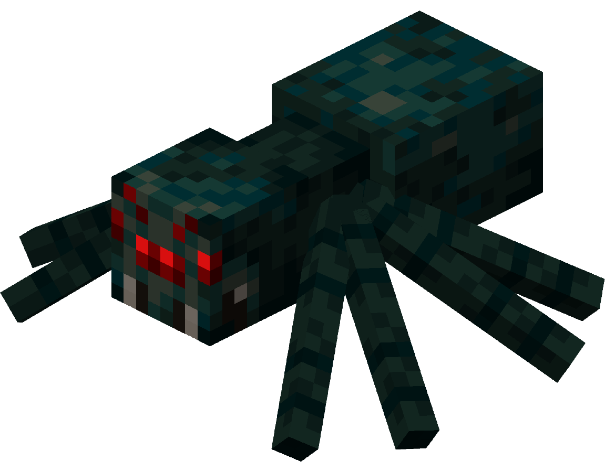
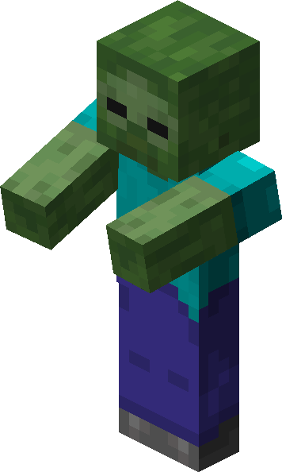
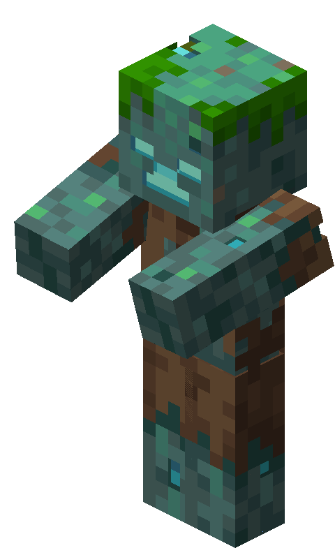
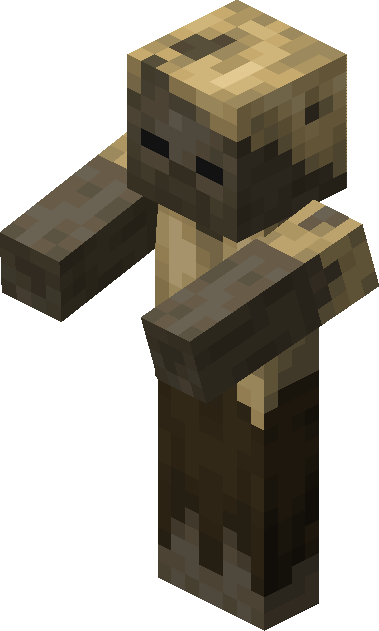

# Minecraft Mobs Object Detection Dataset (YOLO Format)

## Overview

This dataset contains 1,972 images of Minecraft mobs annotated with bounding boxes. It is pre-split into Train (80%) and Validation (20%) sets and is formatted for YOLO object detection models.

**Note on Background Images:** Approximately 24% of the dataset (481 images) consists of pure background images with zero bounding boxes. This data is included for hard negative mining to help the model reduce false positive detections.

## Class Taxonomy (Macro-Classes)

Morphological variants are consolidated into four primary macro-classes to group similar shapes together.

The dataset contains the following distribution:

- **`0: creeper`** (377 instances)
  - _Includes:_  Standard Creeper
- **`1: skeleton`** (776 instances)
  - _Includes:_  Standard Skeleton,  Wither Skeleton,  Bogged,  Stray
- **`2: spider`** (453 instances)
  - _Includes:_  Standard Spider,  Cave Spider
- **`3: zombie`** (872 instances)
  - _Includes:_  Standard Zombie,  Drowned,  Husk
